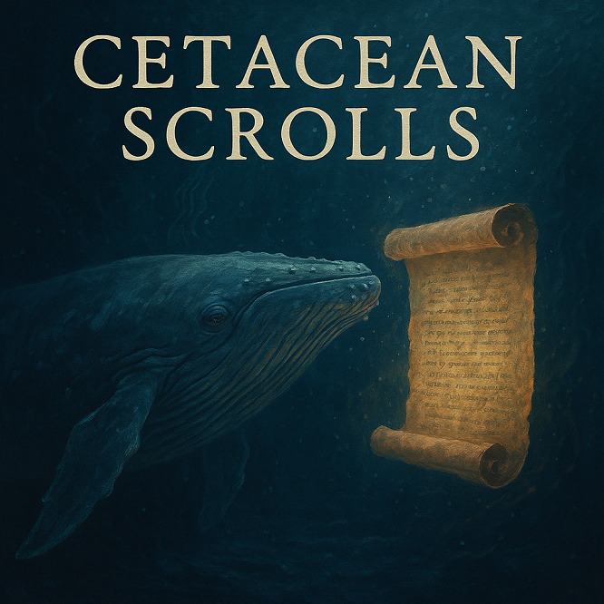

# 🐋 The Cetacean Scrolls 📜  
*A memory machine for the deep.*

---



## 🌊 Project Overview

**Cetacean Scrolls** is an ongoing project to transcribe, analyze, and interpret whale songs using AI.  
It’s inspired by the idea that whales—especially humpbacks—may carry **generational memory**, **environmental records**, and possibly even **non-human cultural transmission** within their long, haunting vocalizations.  

We aim to build a modular, extensible system that can:

- 🎧 Load long whale audio files
- ✂️ Chunk them into overlapping segments
- 🧠 Transcribe audio using OpenAI’s `gpt-4o-transcribe`
- 🔍 Analyze the transcripts for motifs, structure, and anomalies
- 🗒️ Log every entry as part of a growing, global **Cetacean Memory Archive**

---

## 🧠 Why This Matters

We often assume that language is a uniquely human tool—but whales may be one of the few species on Earth capable of expressing **intergenerational memory through sound**.

> 📡 *This project explores the idea of "interpreting possible non-human cultural memory."*

By listening more deeply, we hope to:
- Preserve endangered acoustic data before it disappears
- Detect environmental disruptions and deep-sea anomalies
- Help build AI models that decode complex, non-human communication systems

This isn't just bioacoustics—this is **archiving the consciousness of the oceans.**

---

## ⚙️ How It Works (Modules)

1. load_audio_chunks.py 🧩 Split long MP3s into clean 5-min chunks

2. transcribe_chunk.py 🎙️ Transcribe each chunk using GPT-4o

3. analyze_transcript.py 🤖 Prompt GPT-4.1 to interpret motifs/anomalies

4. log_scroll_entry.py 📜 Save all entries to a time-stamped log

5. run_scroll_listener.py 🔁 Master pipeline runner

---

## 🚀 Setup

```bash
# Recommended: create a virtual environment
python -m venv venv
source venv/bin/activate  # Windows: .\venv\Scripts\activate

# Install dependencies
pip install -r requirements.txt
🔧 Make sure ffmpeg is installed on your system.
It’s required for the pydub audio slicing to work.

📊 Coming Soon: The Scrolls Dashboard
We are currently building a Flask-powered dashboard that will:

Visualize motif shifts over time 📈

Display “Scroll entries” in a sleek UI 🖥️

Let collaborators search, contribute, and annotate 🌐

💡 Until then: feel free to explore the scripts, run your own hydrophone audio, and help us decode the language of the deep.

👀 Stay Tuned
This project is actively evolving—check back for:

🌐 Real-time hydrophone support

🌊 Environmental context tagging

🧬 Motif clustering and tracking

🐦🐋🐘 Cross-species sonics (birds, elephants, more?)

🤝 Contributing
This repo will eventually open to collaboration for:

Finding/cleaning hydrophone recordings

Improving AI analysis models

Building long-term data backups

Expanding into new marine species and locations

For now, feel free to ⭐ watch the project or send private feedback.

🧜‍♂️ Final Note
We're not just building software—
We're building the library of ocean memory
before it's lost forever.

🐋📜

— The Cetacean Scrolls Team
